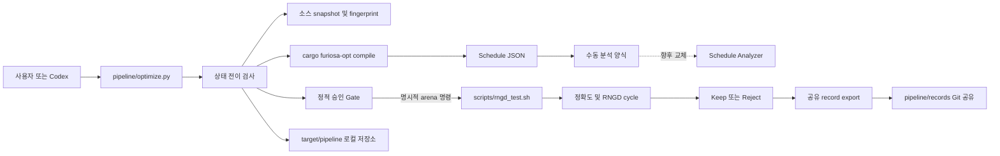
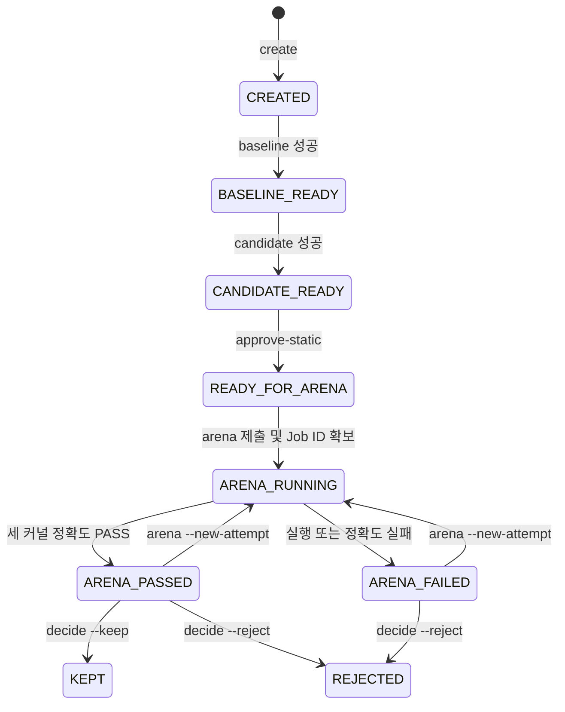

# Stage 1 커널 최적화 파이프라인 설계

- 상태: 사용자 검토용 설계안
- 작성일: 2026-09-12
- 대상 레포: `furiosa-opt-gemma4-12B`
- 1차 대상 커널: `decoder_feedforward`
- 지원 커널: `sliding_project_qkv`, `sliding_attention_output`, `decoder_feedforward`

## 1. 목적

이 문서는 Stage 1 커널 최적화를 반복 가능하고 검토 가능한 실험으로 수행하기 위한
반자동 파이프라인을 정의한다. 파이프라인은 schedule 생성, 정적 분석, 병목 가설
기록, candidate 검증, 원격 RNGD 실행, 결과 판정과 실험 이력 보존을 하나의 상태
흐름으로 묶는다.

1차 버전에서는 사람이 병목의 의미를 해석하고 최적화 가설과 코드 변경을 결정한다.
도구는 명령 실행, 산출물 보존, 상태 검증, 결과 요약과 재현 정보 생성을 담당한다.
향후 schedule analyzer와 AI 기반 candidate 생성기를 같은 경계에 연결하여 자동화
범위를 넓힐 수 있어야 한다.

## 2. 설계 원칙

### 2.1 사실과 판단을 분리한다

schedule의 makespan, context 점유 시간, overlap, node duration과 DMA utilization은
측정 사실이다. “이 복사를 제거해야 한다” 또는 “tile 크기를 늘려야 한다”는 최적화
가설이다. 파이프라인은 두 종류의 정보를 서로 다른 필드와 문서에 기록한다.

### 2.2 정적 schedule은 선별 도구로 사용한다

Schedule Viewer와 schedule JSON은 컴파일러가 만든 정적 실행 계획을 나타낸다.
정적 makespan 감소는 실제 RNGD 성능 향상을 보장하지 않는다. Candidate 채택은 세
커널 정확도와 실제 RNGD cycle을 확인한 뒤에만 가능하다.

### 2.3 원격 실행은 명시적으로 승인한다

파이프라인은 정적 검토가 끝난 candidate를 `READY_FOR_ARENA` 상태에서 멈춘다.
사용자가 `arena` 명령을 직접 실행하기 전에는 원격 Job을 제출하지 않는다.

### 2.4 한 실험에는 한 커널과 한 가설만 둔다

한 experiment는 하나의 대상 커널과 하나의 명시적 가설을 가진다. 여러 독립 변경을
한 candidate에 섞지 않는다. 그래야 schedule 및 RNGD 변화의 원인을 추적할 수 있다.

### 2.5 원본을 덮어쓰지 않는다

Baseline, candidate, Arena 재측정 결과는 한번 생성된 뒤 제자리에서 덮어쓰지 않는다.
재실행은 새로운 attempt 디렉터리를 만든다. 이벤트 이력은 append-only로 기록한다.

### 2.6 자동으로 Git이나 사용자 코드를 변경하지 않는다

파이프라인은 자동 commit, reset, checkout, revert, merge를 수행하지 않는다.
`REJECTED` 판정도 기록만 남기며 working tree를 되돌리지 않는다. 최종
`moa-submitter submit`도 파이프라인 범위에 포함하지 않는다.

## 3. 범위

### 3.1 1차 버전에 포함하는 기능

- 실험 생성과 고유 ID 발급
- 대상 커널, 실험 이름, 가설 기록
- 제출 대상 소스의 baseline/candidate snapshot과 SHA-256 fingerprint 생성
- 단일 커널 `cargo furiosa-opt compile --dump-schedule` 실행
- baseline/candidate schedule 및 compile log 보존
- 수동 schedule 분석 양식 생성
- 정적 검토 승인 gate
- 기존 `scripts/rngd_test.sh`를 통한 명시적 Arena 실행
- Arena Job ID, 정확도 결과와 커널별 cycle 추출
- keep/reject 판정과 이유 기록
- 현재 상태와 다음 실행 가능한 명령 표시
- 로컬 전체 이력과 Git 공유용 경량 record 분리

### 3.2 1차 버전에 포함하지 않는 기능

- schedule 병목의 자동 의미 해석
- AI가 직접 코드를 변경하거나 candidate를 자동 생성하는 기능
- 자동 Git commit 또는 branch 관리
- 실패 candidate의 자동 원복
- Arena의 자동 실행 또는 반복 측정
- `moa-submitter`를 이용한 최종 채점 제출
- 리더보드 등록과 조회
- 웹 대시보드 또는 Schedule Viewer 대체 UI

Schedule parser는 1차 파이프라인의 확장점으로 설계하지만, 파이프라인 골격과 상태
관리 구현이 끝난 뒤 별도 단계에서 개발한다.

## 4. 전체 아키텍처



파이프라인은 Python 표준 라이브러리만 사용하는 CLI로 구현한다. schedule 분석기가
추가되기 전에도 전체 상태 흐름이 동작해야 하며, 분석기는 파일 기반 입출력 규격을
통해 연결한다.

## 5. 소스 디렉터리 구조

```text
pipeline/
├── optimize.py
├── README.md
├── optcycle/
│   ├── __init__.py
│   ├── cli.py
│   ├── kernels.py
│   ├── manifest.py
│   ├── state.py
│   ├── artifacts.py
│   ├── process.py
│   ├── arena.py
│   └── render.py
├── templates/
│   ├── analysis.md
│   ├── experiment-readme.md
│   ├── decision.md
│   └── reproduce.md
├── records/
├── specs/
│   └── 2026-09-12-kernel-optimization-pipeline-design.md
└── tests/
    ├── fixtures/
    ├── test_cli.py
    ├── test_manifest.py
    ├── test_state.py
    ├── test_arena.py
    └── test_export.py
```

모듈별 책임은 다음과 같다.

| 모듈 | 책임 |
|---|---|
| `optimize.py` | 최소 진입점, `optcycle.cli` 호출 |
| `cli.py` | 인자 파싱, 하위 명령 dispatch, 사용자 출력 |
| `kernels.py` | 허용 커널명과 전체 Rust 경로의 고정 매핑 |
| `manifest.py` | manifest load, validate, atomic write |
| `state.py` | 허용 상태 전이와 각 명령의 사전조건 |
| `artifacts.py` | 실험 경로, snapshot, fingerprint, patch, export |
| `process.py` | 외부 명령 실행, 실시간 출력, 로그와 종료 코드 저장 |
| `arena.py` | Arena 출력에서 Job ID, PASS/FAIL, cycle 추출 |
| `render.py` | README, analysis, decision, reproduce 문서 렌더링 |

CLI가 커져도 모든 로직을 `optimize.py` 한 파일에 모으지 않는다. 상태, 파일 조작,
외부 실행과 출력 파싱을 분리하여 단위 테스트할 수 있게 한다.

## 6. 실행 산출물 디렉터리

대용량 또는 재생성 가능한 산출물은 Git에서 제외된 `target/pipeline/`에 저장한다.

```text
target/pipeline/
└── decoder_feedforward/
    └── 20260912-153000-down-project-copy/
        ├── README.md
        ├── manifest.json
        ├── events.jsonl
        ├── source/
        │   ├── baseline/
        │   │   ├── ops.rs
        │   │   └── device/
        │   ├── candidate/
        │   │   ├── ops.rs
        │   │   └── device/
        │   ├── baseline.patch
        │   └── candidate.patch
        ├── schedule/
        │   ├── baseline.json
        │   ├── candidate.json
        │   ├── analysis.md
        │   ├── analysis.json
        │   └── comparison.json
        ├── build/
        │   ├── baseline/
        │   │   └── attempt-001.log
        │   └── candidate/
        │       └── attempt-001.log
        ├── arena/
        │   └── attempt-001/
        │       ├── submit.log
        │       ├── result.log
        │       └── result.json
        └── decision.md
```

Experiment ID 형식은 다음과 같다.

```text
YYYYMMDD-HHMMSS-<slug>
```

상위 디렉터리가 커널명을 포함하므로 ID 자체에는 커널명을 반복하지 않는다. 같은
초에 동일 slug로 생성되어 충돌하면 `-02`, `-03`과 같이 순번을 붙인다. Slug는
영문 소문자, 숫자와 하이픈만 허용한다.

## 7. 상태 모델



초기 논의에 있던 `STATIC_REVIEWED`는 별도 영구 상태로 두지 않는다. 정적 검토
내용은 이벤트와 `analysis.md`에 기록하고, 승인이 완료되면 상태를 곧바로
`READY_FOR_ARENA`로 전환한다. 이렇게 하면 “검토는 끝났지만 Arena 실행 준비가
되지 않은 상태”라는 중복 상태를 피할 수 있다.

다음 규칙을 강제한다.

- `baseline`은 `CREATED`에서만 실행한다.
- `candidate`는 `BASELINE_READY`에서만 실행한다.
- `approve-static`은 baseline/candidate schedule과 `analysis.md`가 있을 때만 허용한다.
- 최초 `arena`는 `READY_FOR_ARENA`에서만 Job을 제출한다.
- `arena --new-attempt`는 이전 Arena attempt가 terminal 상태일 때만 허용한다.
- Arena Job ID를 얻은 즉시 `ARENA_RUNNING`을 원자적으로 저장한다.
- 하나 이상의 유효한 PASS attempt가 있으면 experiment를 `ARENA_PASSED`로 본다.
- `--keep`은 하나 이상의 유효한 PASS attempt가 있을 때만 허용한다.
- `--reject`는 `ARENA_PASSED` 또는 `ARENA_FAILED`에서 허용한다.
- 최종 상태인 `KEPT`와 `REJECTED`에서는 기존 산출물을 변경하지 않는다.

명령 실패는 상태를 다음 단계로 진행시키지 않는다. 실패 정보는 별도 attempt 또는
event로 남기고, 사용자는 원인을 고친 뒤 같은 단계의 새 attempt를 실행할 수 있다.
Candidate schedule 생성 후 소스를 다시 변경하면 기존 experiment를 갱신하지 않고
새 experiment를 만든다. 한 experiment가 정확히 한 candidate를 나타내도록 하기
위함이다.

## 8. CLI 설계

모든 명령은 레포 루트에서 다음 형식으로 실행한다.

```bash
python3 pipeline/optimize.py <COMMAND> [OPTIONS]
```

### 8.1 실험 생성

```bash
python3 pipeline/optimize.py create \
  --kernel decoder_feedforward \
  --name down-project-copy \
  --hypothesis "project_down의 중간 DM 복사를 줄이면 TDMA cycle이 감소한다"
```

`create`는 다음을 수행한다.

1. 커널명과 slug를 검증한다.
2. 실험 디렉터리와 초기 manifest를 생성한다.
3. Git HEAD, Git status와 제출 범위 fingerprint를 기록한다.
4. 최초 `README.md`와 `events.jsonl`을 생성한다.
5. Experiment ID와 다음 명령을 출력한다.

### 8.2 Baseline schedule

```bash
python3 pipeline/optimize.py baseline <EXPERIMENT_ID>
```

`baseline`은 제출 대상 소스를 snapshot한 뒤 대상 커널을 정확 일치로 컴파일한다.

```bash
cargo furiosa-opt compile ops::decoder_feedforward --exact \
  --dump-schedule <EXPERIMENT_DIR>/schedule/baseline.json
```

컴파일 성공과 schedule 파일 생성을 모두 확인한 뒤 `BASELINE_READY`로 전환한다.

### 8.3 Candidate schedule

사용자가 코드를 변경한 뒤 실행한다.

```bash
python3 pipeline/optimize.py candidate <EXPERIMENT_ID>
```

Candidate source snapshot, fingerprint와 baseline 대비 patch를 만든 뒤 같은 커널을
컴파일한다. Snapshot과 patch를 먼저 임시 경로에 생성하고, compile이 성공하면
candidate artifact 경로로 원자적으로 이동한다.

### 8.4 Schedule 분석

```bash
python3 pipeline/optimize.py analyze <EXPERIMENT_ID>
```

1차 버전은 baseline/candidate 파일 경로, 기록 항목과 판정 질문이 포함된
`analysis.md`를 만든다. 사용자가 Viewer나 보조 명령으로 확인한 값을 입력한다.

분석기를 연결한 이후에도 명령 이름과 산출물 경로는 유지한다. 자동 분석 결과는
`analysis.json`과 `comparison.json`에 기록하고, `analysis.md`에는 사람이 읽기 쉬운
요약을 렌더링한다.

### 8.5 정적 검토 승인

```bash
python3 pipeline/optimize.py approve-static <EXPERIMENT_ID> \
  --note "makespan 감소와 TDMA 구간 단축을 확인해 Arena 검증을 진행한다"
```

이 명령은 정적 개선을 스스로 주장하지 않는다. 사용자가 입력한 승인 note와 당시
analysis 파일 hash를 기록하고 `READY_FOR_ARENA`로 전환한다.

### 8.6 Arena 실행

```bash
python3 pipeline/optimize.py arena <EXPERIMENT_ID>
```

파이프라인은 기존 스크립트를 재사용한다.

```bash
RNGD_JOB_NAME=<EXPERIMENT_ID>-a001 ./scripts/rngd_test.sh
```

출력은 터미널에 실시간으로 보여주면서 attempt의 `submit.log`와 `result.log`에
기록한다. 실제 숫자 Job ID를 확보하면 즉시 manifest에 저장한다. 실행이 중단되어도
Job ID가 있으면 다음 명령으로 상태와 로그를 다시 동기화한다.

```bash
python3 pipeline/optimize.py sync-arena <EXPERIMENT_ID>
```

재측정은 이전 attempt가 terminal 상태일 때 명시적으로 요청한다. 이후 attempt가
실패하더라도 이전 PASS evidence는 manifest에 남으며, experiment 상태는 하나 이상의
유효한 PASS attempt가 있는지를 기준으로 계산한다.

```bash
python3 pipeline/optimize.py arena <EXPERIMENT_ID> --new-attempt
```

Arena 실행 제한 70초와 로컬 polling 제한은 `scripts/rngd_test.sh`의 기존 정책을
그대로 사용한다.

### 8.7 최종 결정

```bash
python3 pipeline/optimize.py decide <EXPERIMENT_ID> \
  --keep \
  --reason "세 커널 정확도 PASS, decoder cycle 감소"
```

또는 다음과 같이 거절한다.

```bash
python3 pipeline/optimize.py decide <EXPERIMENT_ID> \
  --reject \
  --reason "정적 makespan은 감소했으나 실제 RNGD cycle이 증가함"
```

`decide`는 `decision.md`, manifest와 event만 갱신한다. 소스나 Git 상태를 변경하지
않는다.

### 8.8 조회와 export

```bash
python3 pipeline/optimize.py list
python3 pipeline/optimize.py show <EXPERIMENT_ID>
python3 pipeline/optimize.py export <EXPERIMENT_ID>
```

- `list`: 커널, ID, 상태, 가설 요약, 최종 결정을 표로 출력한다.
- `show`: 실험 README와 다음 실행 가능한 명령을 출력한다.
- `export`: 최종 상태인 실험의 경량 공유 record를 생성한다.

## 9. 제출 대상 소스와 fingerprint

최종 제출 범위에 맞춰 다음만 snapshot한다.

```text
src/ops.rs
src/device/**
```

Fingerprint는 각 파일의 레포 상대 경로와 내용 SHA-256을 경로순으로 연결한 뒤 다시
SHA-256으로 계산한다. 파일 timestamp, 권한과 절대 경로는 fingerprint에 포함하지
않는다. 동일한 제출 소스는 어느 머신에서도 동일 fingerprint를 가져야 한다.

Baseline 재현을 위해 두 patch를 구분한다.

- `baseline.patch`: 기록된 Git `base_commit`에서 baseline snapshot으로 가는 patch
- `candidate.patch`: baseline snapshot에서 candidate snapshot으로 가는 patch

Working tree가 처음부터 dirty해도 이 구조로 baseline과 candidate를 재현할 수 있다.
Patch 생성은 snapshot 디렉터리 사이의 명시적 비교로 수행하며 사용자의 working
tree를 임시로 checkout하거나 변경하지 않는다.

## 10. Manifest 설계

`manifest.json`은 현재 상태를 나타내는 기계 판독용 snapshot이다. 갱신은 임시
파일을 같은 파일시스템에 쓴 뒤 `os.replace`로 원자적으로 수행한다.

```json
{
  "schema_version": 1,
  "experiment_id": "20260912-153000-down-project-copy",
  "kernel": {
    "name": "decoder_feedforward",
    "rust_path": "ops::decoder_feedforward"
  },
  "name": "down-project-copy",
  "hypothesis": "project_down의 중간 DM 복사를 줄이면 TDMA cycle이 감소한다",
  "state": "READY_FOR_ARENA",
  "created_at": "2026-09-12T15:30:00+09:00",
  "updated_at": "2026-09-12T16:20:00+09:00",
  "git": {
    "base_commit": "<full commit sha>",
    "initial_status": ["M scripts/rngd_test.sh"]
  },
  "source": {
    "baseline_fingerprint": "<sha256>",
    "candidate_fingerprint": "<sha256>"
  },
  "schedule": {
    "baseline": {
      "path": "schedule/baseline.json",
      "sha256": "<sha256>"
    },
    "candidate": {
      "path": "schedule/candidate.json",
      "sha256": "<sha256>"
    },
    "analysis_path": "schedule/analysis.md",
    "approved_note": "makespan 감소와 TDMA 구간 단축을 확인"
  },
  "arena": {
    "attempts": []
  },
  "decision": null
}
```

Manifest 안의 모든 artifact 경로는 experiment 디렉터리 기준 상대 경로다. 사용자
홈 디렉터리나 임시 staging 경로를 저장하지 않는다.

## 11. 이벤트 기록

`events.jsonl`은 append-only 감사 기록이다. 한 줄에 하나의 JSON 객체를 쓴다.

```json
{"at":"2026-09-12T15:30:00+09:00","event":"CREATED","result":"success"}
{"at":"2026-09-12T15:32:10+09:00","event":"BASELINE_COMPILE","result":"success","exit_code":0}
{"at":"2026-09-12T16:20:00+09:00","event":"STATIC_APPROVED","result":"success"}
```

이벤트에는 명령 인자 전체나 환경변수 전체를 기록하지 않는다. Token, credential과
민감한 환경값이 로그에 남는 것을 방지한다. 필요한 경우 허용된 필드만 명시적으로
기록한다.

## 12. 실험 README

각 실험의 `README.md`는 manifest에서 자동 렌더링하며 사람이 가장 먼저 읽는
인덱스 역할을 한다.

```markdown
# down-project-copy

- Experiment: 20260912-153000-down-project-copy
- Kernel: decoder_feedforward
- State: ARENA_PASSED
- Hypothesis: project_down의 중간 DM 복사를 줄이면 TDMA cycle이 감소한다.

## Source

- Base commit: ...
- Baseline fingerprint: ...
- Candidate fingerprint: ...
- Change: source/candidate.patch

## Static result

- Baseline schedule: schedule/baseline.json
- Candidate schedule: schedule/candidate.json
- Review: schedule/analysis.md

## RNGD result

- Attempt: 001
- Arena Job: ...
- Accuracy: PASS
- decoder_feedforward cycle: ...

## Decision

KEEP 또는 REJECT와 근거

## Timeline

- 15:30 CREATED
- 15:32 BASELINE_READY
- 16:20 READY_FOR_ARENA
- 16:31 ARENA_PASSED
```

README는 원본 데이터가 아니며 언제든 manifest와 events에서 다시 생성할 수 있다.

## 13. Arena 결과 모델

Arena attempt 결과는 다음 정보를 가진다.

```json
{
  "attempt": 1,
  "job_id": 18961,
  "job_name": "20260912-153000-down-project-copy-a001",
  "status": "SUCCEEDED",
  "exit_code": 0,
  "accuracy_passed": true,
  "kernels": {
    "sliding_project_qkv": {"passed": true, "cycles": 250288},
    "sliding_attention_output": {"passed": true, "cycles": 409907},
    "decoder_feedforward": {"passed": true, "cycles": 3704175}
  }
}
```

`ARENA_PASSED`는 Job 성공만 의미하지 않는다. 세 커널의 PASS와 세 cycle 값이 모두
파싱되어야 한다. Job은 성공했지만 결과 형식이 예상과 다르면 파싱 실패로 표시하고
원본 로그를 보존한 채 사용자의 확인을 요구한다.

## 14. 공유 record 아키텍처

Git으로 공유하는 record에는 요약, patch와 재현 정보만 포함한다.

```text
pipeline/records/<EXPERIMENT_ID>/
├── README.md
├── manifest.json
├── baseline.patch
├── candidate.patch
└── REPRODUCE.md
```

### 14.1 포함하는 정보

- 실험 ID, 커널, 이름과 가설
- 상태와 keep/reject 결정 이유
- base commit과 source fingerprint
- schedule 및 Arena 측정값 요약
- Arena Job ID
- baseline 및 candidate patch
- 재현에 필요한 명령과 도구 버전
- 원본 artifact의 SHA-256

### 14.2 제외하는 정보

- raw schedule JSON
- 전체 compile 및 Arena 로그
- test binary와 fixture
- source snapshot 전체 복사본
- 절대 홈 경로와 임시 디렉터리
- credential, token과 전체 환경변수

Export manifest는 로컬 manifest를 그대로 복사하지 않고 공유 허용 필드만 새 객체로
만든다. 경로가 필요한 경우 레포 상대 경로만 기록한다.

### 14.3 재현 문서

`REPRODUCE.md`는 자동으로 working tree를 변경하는 실행 파일이 아니다. 사용자가
patch를 검토한 후 직접 실행할 명령을 제공한다.

현재 checkout을 변경하지 않도록 별도 Git worktree에서 재현한다.

```bash
git worktree add ../reproduce-<EXPERIMENT_ID> <BASE_COMMIT>

git -C ../reproduce-<EXPERIMENT_ID> apply --check \
  "$PWD/pipeline/records/<EXPERIMENT_ID>/baseline.patch"
git -C ../reproduce-<EXPERIMENT_ID> apply \
  "$PWD/pipeline/records/<EXPERIMENT_ID>/baseline.patch"
git -C ../reproduce-<EXPERIMENT_ID> apply --check \
  "$PWD/pipeline/records/<EXPERIMENT_ID>/candidate.patch"
git -C ../reproduce-<EXPERIMENT_ID> apply \
  "$PWD/pipeline/records/<EXPERIMENT_ID>/candidate.patch"

cargo furiosa-opt compile ops::decoder_feedforward --exact \
  --manifest-path ../reproduce-<EXPERIMENT_ID>/Cargo.toml \
  --dump-schedule ../reproduce-<EXPERIMENT_ID>/target/reproduced.schedule.json
```

재현 문서에는 Rust toolchain, `cargo-furiosa-opt`, schedule viewer와 Arena CLI 버전을
함께 기록한다. RNGD cycle은 원격 evaluator 상태에 영향을 받을 수 있으므로 기존
측정값과 새 측정값을 별개로 보존한다.

## 15. Schedule analyzer 확장 경계

향후 analyzer는 raw schedule을 입력받아 다음 두 파일을 출력한다.

```text
schedule/analysis.json
schedule/analysis.md
```

`analysis.json`의 최소 계약은 다음과 같다.

```json
{
  "schema_version": 1,
  "schedule_sha256": "<sha256>",
  "kernel": "decoder_feedforward",
  "facts": {
    "makespan": 1693200,
    "contexts": {},
    "overlaps": {},
    "hotspots": [],
    "memory": {}
  },
  "comparison": null,
  "warnings": []
}
```

Analyzer가 생성할 수 있는 사실은 다음으로 제한한다.

- 전체 makespan
- context별 interval union과 busy 비율
- context 쌍별 overlap과 idle 구간
- 소스 위치별 count, total duration, max duration
- 반복 패턴과 cycle 범위
- DMA node의 base/total utilization과 efficiency
- buffer type별 peak 사용량과 긴 tensor lifetime
- baseline 대비 절대 및 상대 delta

최적화 가설, 추천 코드 변경과 candidate 우선순위는 `facts`에 넣지 않는다. 향후 AI
adapter는 `analysis.json`, `analysis.md`, 관련 소스 excerpt와 사용자 목표를 조합한
별도 prompt bundle을 생성한다.

Analyzer가 없거나 실패해도 사용자는 수동 `analysis.md`로 파이프라인을 계속 사용할
수 있어야 한다. Analyzer 실패는 candidate compile 결과를 무효화하지 않는다.

## 16. 외부 명령 실행 규칙

- 모든 명령은 레포 루트를 working directory로 사용한다.
- 인자는 shell 문자열로 조합하지 않고 argument list로 전달한다.
- stdout과 stderr를 원본 순서에 가깝게 실시간 표시하고 파일에도 저장한다.
- 종료 코드와 시작/종료 시각을 manifest와 event에 기록한다.
- 성공 판정은 종료 코드뿐 아니라 기대 산출물 존재와 non-empty 여부도 확인한다.
- 기존 파일 경로를 출력 대상으로 사용할 때는 실행 전에 충돌을 검사한다.
- 임시 파일은 experiment 디렉터리와 같은 파일시스템에 만들고 성공 후 원자적으로
  이동한다.
- SIGINT를 받으면 자식 프로세스에 전달하고 중단 event를 남긴다.

## 17. 오류 처리와 재개

| 상황 | 처리 |
|---|---|
| 커널명 오류 | 허용 목록을 출력하고 실험을 만들지 않음 |
| compile 실패 | log 보존, 상태 유지, 새 attempt 허용 |
| schedule 미생성 | compile 성공이어도 단계 실패 처리 |
| source fingerprint 동일 | candidate 생성 시 경고하되 실행 가능 |
| source fingerprint 불일치 | Arena 직전에 candidate snapshot과 현재 소스가 다르면 실행 거부 |
| Arena submit 실패 | attempt 실패 기록, `READY_FOR_ARENA` 유지 |
| Job ID 파싱 실패 | 원본 출력 보존, 새 Job 자동 제출 금지 |
| 로컬 실행 중단 | 저장된 Job ID가 있으면 `sync-arena` 안내 |
| 정확도 실패 | `ARENA_FAILED`, keep 금지 |
| cycle 누락 | 파싱 실패로 처리하고 수동 확인 요구 |
| export 경로 존재 | 덮어쓰지 않고 동일 record인지 hash 비교 |

재개는 현재 manifest 상태와 산출물 검증 결과를 기준으로 한다. 파일만 존재한다고
단계를 성공으로 간주하지 않고 기록된 hash가 현재 파일과 일치하는지 확인한다.

## 18. 안전과 데이터 보존

- Experiment ID는 경로 구분자와 `..`를 허용하지 않는다.
- 모든 artifact 경로는 정규화 후 `target/pipeline/` 내부인지 확인한다.
- 삭제 명령은 1차 버전에 제공하지 않는다.
- Snapshot은 읽기 전용 성격의 기록이며 원본 소스로 복사해 되돌리는 명령을 제공하지
  않는다.
- Export 전에 credential 형태의 키 이름과 절대 경로를 검사한다.
- Arena 및 compile 원본 로그는 로컬에 보존하지만 공유 record에는 포함하지 않는다.
- Fixture와 바이너리는 experiment 디렉터리에 영구 복사하지 않는다.

## 19. 테스트 전략

테스트는 Python 표준 `unittest`와 임시 디렉터리를 사용한다. 실제 원격 Arena나 실제
NPU는 테스트에서 호출하지 않는다.

### 19.1 단위 테스트

- manifest schema와 필수 필드 검증
- atomic write 도중 실패해도 기존 manifest 보존
- 허용/금지 상태 전이 전체 표 검증
- experiment ID와 경로 탈출 방지
- deterministic source fingerprint
- baseline/candidate snapshot 차이와 patch 생성
- Arena 로그에서 Job ID, PASS/FAIL과 cycle 파싱
- README와 공유 manifest의 필드 정제

### 19.2 통합 테스트

임시 `PATH` 앞에 가짜 `cargo`, `furiosa-arena`와 `rngd_test.sh`를 배치해 전체 CLI를
검증한다.

- `create → baseline → candidate → analyze → approve-static` 정상 흐름
- 승인 전 `arena` 실행 거부
- compile 실패 후 상태 유지와 로그 보존
- 같은 산출물 덮어쓰기 거부
- Arena 성공, 정확도 실패, 로그 형식 오류
- 중단 후 저장된 Job ID를 이용한 `sync-arena`
- keep/reject 제약
- export 결과에 raw log와 절대 경로가 없는지 검사
- export patch를 새 임시 tree에 적용해 source fingerprint 재현

### 19.3 수동 smoke test

자동 테스트 통과 후 실제 레포에서 `decoder_feedforward` 실험 하나를 만들고 baseline
schedule까지 생성한다. 원격 Arena smoke test는 사용자가 명시적으로 승인한 경우에만
수행한다.

## 20. 구현 단계

### 단계 A: 상태와 저장소

- `pipeline/` package와 CLI entrypoint
- kernel allowlist
- manifest, event log와 상태 머신
- `create`, `list`, `show`

### 단계 B: Source와 schedule

- submission source snapshot과 fingerprint
- baseline/candidate compile runner
- compile attempt와 schedule hash
- baseline/candidate patch 생성

### 단계 C: 정적 검토 gate

- 수동 `analysis.md` 템플릿
- `analyze`, `approve-static`
- Arena 직전 candidate fingerprint 재검증

### 단계 D: Arena 검증

- `scripts/rngd_test.sh` 연동
- 실시간 Job ID 추출
- attempt 보존과 `sync-arena`
- 정확도 및 cycle 결과 모델

### 단계 E: 판정과 공유

- `decide`, `export`
- 실험 README 자동 생성
- 공유 manifest 정제
- `REPRODUCE.md`와 patch 재현 테스트

### 단계 F: Schedule analyzer

- schedule JSON schema parser
- context interval과 overlap 계산
- source hotspot과 메모리 통계
- baseline/candidate comparison
- AI용 Markdown prompt bundle

각 단계는 해당 자동 테스트가 통과한 뒤 다음 단계로 넘어간다. 단계 F는 A~E의
파이프라인 계약을 변경하지 않고 `analyze` 구현을 확장한다.

## 21. 완료 기준

1차 파이프라인은 다음 조건을 모두 만족하면 완료로 본다.

- 세 대상 커널 중 하나를 선택해 새 experiment를 생성할 수 있다.
- baseline과 candidate schedule을 별도 파일로 생성하고 hash를 검증한다.
- 코드가 처음부터 dirty해도 두 source 상태와 변경 patch를 복원할 수 있다.
- 수동 분석과 승인 없이는 Arena가 실행되지 않는다.
- Arena 실행 후 Job ID, 세 커널 정확도와 cycle이 experiment에 기록된다.
- 실패와 중단 뒤에도 이전 산출물을 잃지 않고 재개할 수 있다.
- keep/reject 결정이 코드 변경과 분리되어 기록된다.
- 실험 목록과 상세 내용을 CLI로 다시 확인할 수 있다.
- 공유 record에는 요약, patch와 재현 정보만 포함된다.
- 공유 record만으로 candidate source fingerprint와 schedule 생성 명령을 재현할 수 있다.
- 실제 Arena와 NPU 없이 자동 테스트가 전체 상태 흐름을 검증한다.

## 22. 확정한 설계 결정

- 1차는 반자동 파이프라인으로 구현한다.
- 자동 병목 분석과 AI 코드 변경은 후속 단계로 분리한다.
- 구현은 `pipeline/` 아래 Python CLI로 구성한다.
- 원격 Arena는 `READY_FOR_ARENA`에서 명시적으로 실행한다.
- 각 experiment는 독립 폴더와 append-only event 이력을 가진다.
- 로컬 원본은 `target/pipeline/`에 보존한다.
- Git 공유 record에는 요약, patch와 재현 정보만 포함한다.
- 기존 `scripts/rngd_test.sh`를 재사용한다.
- 파이프라인은 Git 상태나 소스를 자동으로 되돌리지 않는다.
- 최종 채점과 리더보드 제출은 파이프라인 범위 밖에 둔다.
